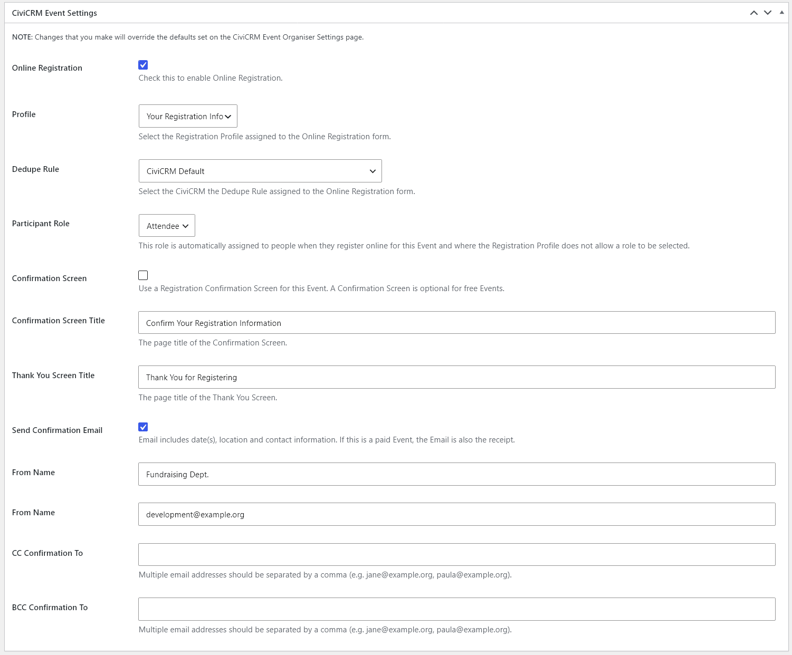
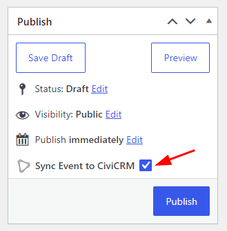
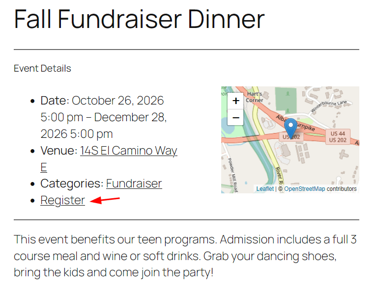

# Events integration

When adding a New Event in Event Organiser there are some CiviCRM Settings that can be used if an event will use CiviCRM integration for Registration. When adding a New Event there are fewer settings visible.

If you will also be enabling Registration, select the **Enable Online Registration** option and select the Profile, Participant Role, and fill out Confirmation Page and Email settings. The default [settings](./settings.md) will be used if nothing is changed.

Once your event details are in place, ensure you have the right Event Category selected. Then click on the **Sync Event to CiviCRM** option for the event to be created in CiviCRM.

Once you've enabled registration when viewing an event on the website, there will be a Register link that brings visitors to the CiviCRM Event Registration page for that event.

## Sync behavior

The following tables describe sync behavior for linked events.

In **Settings > CiviCRM Event Organiser**, choose when WordPress events sync to CiviCRM:

| Event Format | Show checkbox on each Event Organiser Event | Sync all Event Organiser Events to CiviCRM |
| --- | --- | --- |
| Single event | Select **Sync Event to CiviCRM** upon event creation to establish the link. Subsequent updates will sync automatically. | Syncs on save automatically. |
| Recurring event | Select the sync checkbox each time you want to sync. | Select the sync checkbox each time you want to sync. |

**Recurring events:** Ensure you finalize the recurring schedule before syncing, as later schedule changes can produce unexpected results.

**Drafts:** Drafts do not sync unless you explicitly check **Sync Event to CiviCRM**. This would only apply if you have the setting to optional sync events, otherwise a draft under the **Sync all Event Organiser Events to CiviCRM** setting will always be excluded; use **Pending Review** to sync without publishing.

### WordPress to CiviCRM

| WordPress action | CiviCRM result |
| --- | --- |
| Move an event to Trash | No change |
| Restore an event from Trash | The original CiviCRM event remains linked |
| Make an event Private | The linked CiviCRM event is no longer included in CiviCRM "Include in Upcoming Events" core listing |
| Permanently delete an event | The linked CiviCRM event(s) become disabled |

### CiviCRM to WordPress

| CiviCRM action | WordPress result |
| --- | --- |
| Turn off "Include in Upcoming Events" | The linked WordPress event becomes Private |
| Disable an event | The linked WordPress event becomes Draft |
| Delete an event | The linked WordPress event becomes Draft |

**Recurring events:**

* Each occurrence of a recurring WordPress event is linked to a separate CiviCRM event.
* Deleting one linked CiviCRM event removes **only that link** but leaves the recurring WordPress event intact.
* Permanently deleting the recurring WordPress event disables all its linked CiviCRM events.
* Status and visibility changes otherwise follow the tables above.

## Permissions & Capabilities

For Users to sync Events between Event Organiser and CiviCRM, they must have the `publish_events` capability and the `access CiviEvent` permission.
