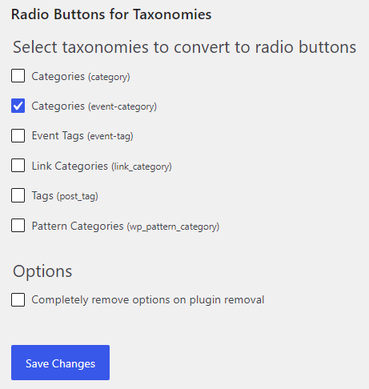
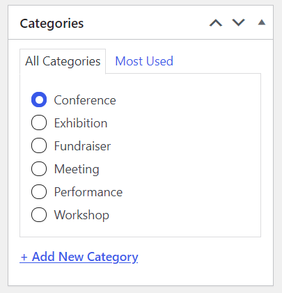
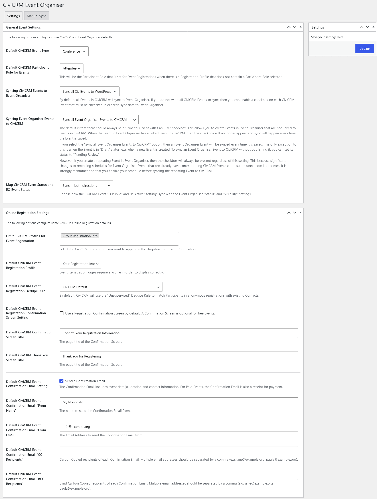

# CiviCRM Event Organiser Settings

Make sure **CiviCRM Event Organiser** and **Radio Buttons for Taxonomies** plugins are activated.

Go to **Settings > Radio Buttons for Taxonomies** and select `Categories (event-category)` and save. This needs to be done since only one Event Type can be selected in CiviCRM for each event.

Once you have done this, the Events Categories now will look like this:

And if the event is synced it will use the same Event Type in CiviCRM.

Then go to **Settings > CiviCRM Event Organiser** to configure the following settings.

## General Event Settings

* Default CiviCRM Event Type
* Default CiviCRM Participant Role for Events
* Syncing CiviCRM Events to Event Organiser mode
* Syncing Event Organiser Events to CiviCRM mode
* Map CiviCRM Event Status and EO Event Status mode

## Online Registration Settings

These settings define the defaults for CiviCRM online registration.

* Limit CiviCRM Profiles for Event Registration
* Default CiviCRM Event Registration Profile
* Default CiviCRM Event Registration Dedupe Rule
* Default CiviCRM Event Registration Confirmation Screen Setting
* Default CiviCRM Confirmation Screen Title
* Default CiviCRM Thank You Screen Title
* Default CiviCRM Event Confirmation Email Setting
* Default CiviCRM Event Confirmation Email "From Name"
* Default CiviCRM Event Confirmation Email "From Email"
* Default CiviCRM Event Confirmation Email "CC Recipients"
* Default CiviCRM Event Confirmation Email "BCC Recipients"

## Manual Sync

The **Manual Sync** tab allows an initial sync of existing data between Event Organiser and CiviCRM. It is recommended to run **CiviCRM Event Types to Event Organiser Categories** so that the Event Types in CiviCRM match the Event Categories in Event Organiser.

Once completed you can now add and sync [events](./events.md).
